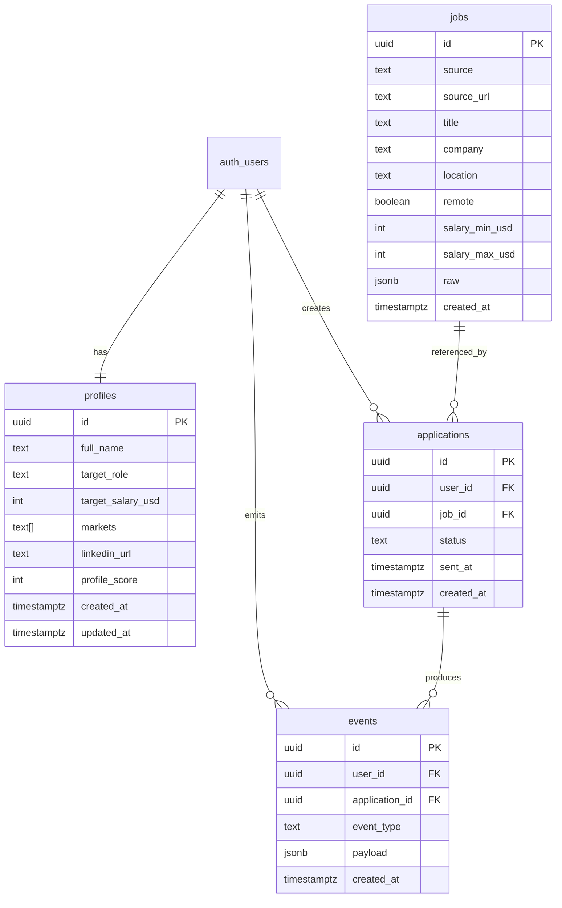

# JobAI Database ERD (v1)

## Notes
- `profiles.id` is 1:1 with `auth.users.id`.
- `jobs` has uniqueness on `(source, source_url)`.
- `events` is append-only tracking for funnel and webhook outcomes.
- RLS is enabled on user-scoped tables (`profiles`, `applications`, `events`).
